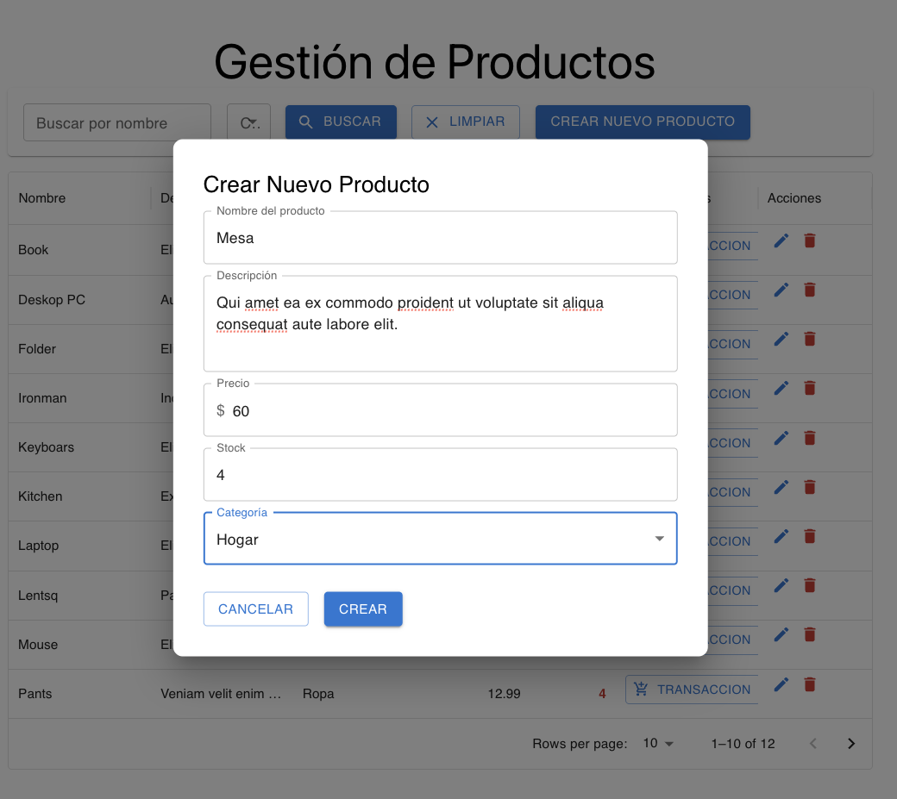
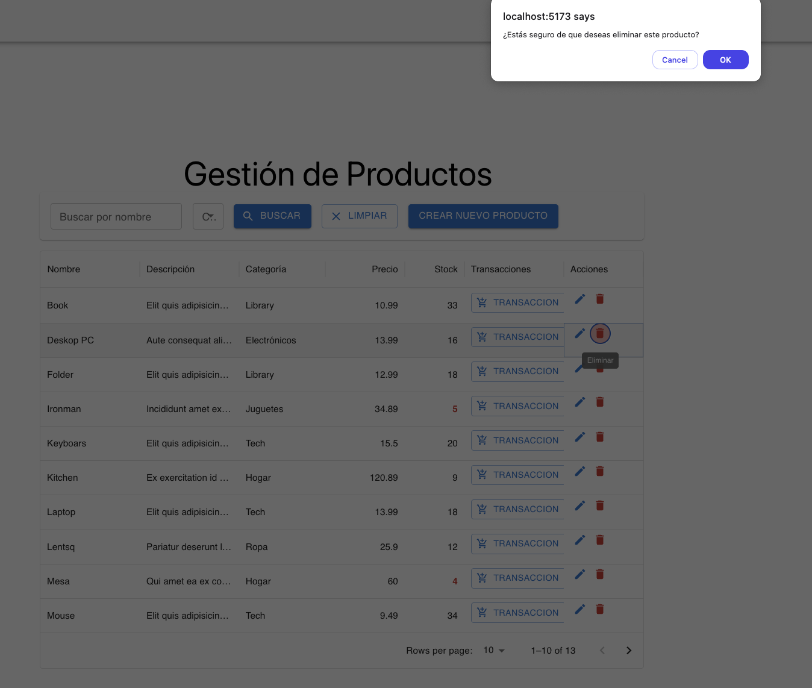

# netby
Netby

## Pasos para ejecutar las APIs

### Requisitos previos
- .NET 8 SDK
- SQL Server (o SQL Server Express)
- Visual Studio 2022, VS Code con extensiones de C# o Rider

### Configuración de la Conexión a la Base de Datos

Antes de ejecutar las APIs, debes configurar la cadena de conexión a la base de datos en los archivos `appsettings.Development.json` de cada servicio:

1. Para la API de Productos:
   ```json
   // api/src/Services/ProductService/ProductService.API/appsettings.Development.json
   {
     "ConnectionStrings": {
       "DefaultConnection": "Data Source=tu_servidor;Initial Catalog=ProductDB;User ID=tu_usuario;Password=tu_contraseña;TrustServerCertificate=True"
     },
     // Resto de la configuración...
   }
   ```

2. Para la API de Transacciones:
   ```json
   // api/src/Services/TransactionService/TransactionService.API/appsettings.Development.json
   {
     "ConnectionStrings": {
       "DefaultConnection": "Data Source=tu_servidor;Initial Catalog=TransactionDB;User ID=tu_usuario;Password=tu_contraseña;TrustServerCertificate=True"
     },
     "ServiceUrls": {
       "ProductService": "http://localhost:5280"
     },
     // Resto de la configuración...
   }
   ```

### Instrucciones para Product API

1. Navega al directorio de la API de productos:
   ```bash
   cd api/src/Services/ProductService/ProductService.API
   ```

2. Restaura las dependencias:
   ```bash
   dotnet restore
   ```

3. Actualiza la base de datos:
   ```bash
   dotnet ef database update
   ```

4. Ejecuta la API:
   ```bash
   dotnet run
   ```

   La API estará disponible en http://localhost:5280

### Instrucciones para Transaction API

1. Navega al directorio de la API de transacciones:
   ```bash
   cd api/src/Services/TransactionService/TransactionService.API
   ```

2. Restaura las dependencias:
   ```bash
   dotnet restore
   ```

3. Actualiza la base de datos:
   ```bash
   dotnet ef database update
   ```

4. Ejecuta la API:
   ```bash
   dotnet run
   ```

   La API estará disponible en http://localhost:5282

### Verificación
Una vez en ejecución, puedes acceder a la documentación Swagger:
- Product API: http://localhost:5280/swagger
- Transaction API: http://localhost:5282/swagger

## Pasos para ejecutar el Frontend

### Requisitos previos
- Node.js (v16 o superior)
- npm (v8 o superior)

### Instrucciones

1. Navega al directorio del frontend:
   ```bash
   cd frontend
   ```

2. Instala las dependencias:
   ```bash
   npm install
   ```

3. Inicia la aplicación en modo desarrollo:
   ```bash
   npm run dev
   ```

   El frontend estará disponible en http://localhost:5173

4. Para construir la aplicación para producción:
   ```bash
   npm run build
   ```

### Notas importantes
- Asegúrate de que las APIs estén ejecutándose antes de iniciar el frontend
- Si cambias los puertos de las APIs, deberás actualizar las URLs en el archivo `frontend/src/config/api.js`

## Capturas de Pantalla

### Gestión de Productos

#### Tabla de Productos


#### Crear Producto


#### Actualizar Producto


#### Eliminar Producto


#### Filtro de Productos


### Gestión de Transacciones

#### Tabla de Transacciones


#### Registrar Compra


#### Registrar Venta


#### Filtro de Transacciones

